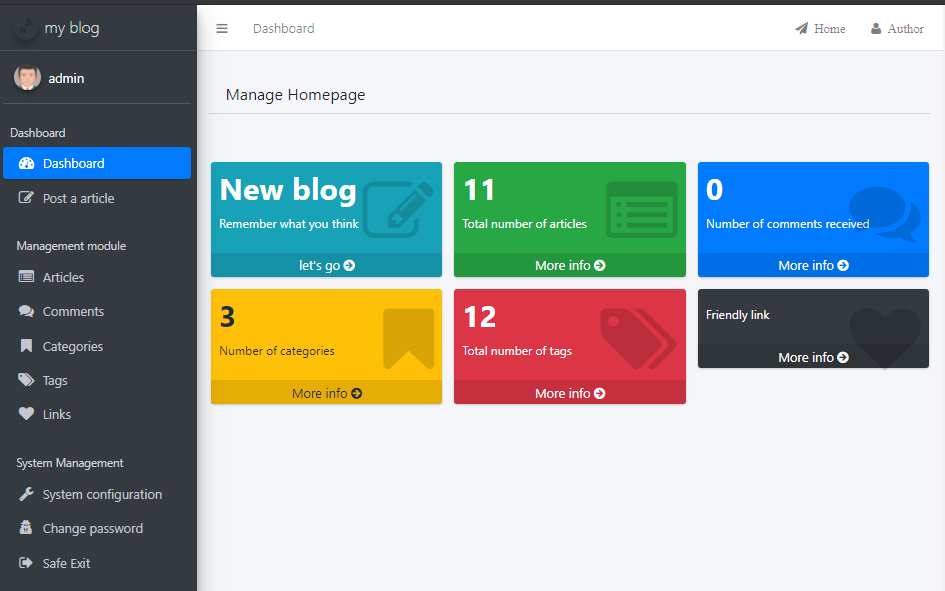

# Simple blog (SpringBoot, Hibernate, Thymeleaf)

### **DESCTIPTION**

The blog project is developed using SpringBoot + Hibernate + Thymeleaf technologies.
This project is a simple blog implementation designed to give yourself and other developers one of example of how this can be done.

The blog UI has been simplified as much as possible in order to focus more on the backend of the site. Any editing of a blog, adding, deleting or changing elements (articles, categories, tags, settings, etc.) is done through the admin panel.
The admin panel itself is a slightly stripped down and revised version of the AdminLte3 template

As the structure of the project was used "Package-by-features". The choice of this is justified by the fact that it is much easier to navigate in the project and search for files associated with a specific feature.

### **INSTALLATION AND USE INSTRUCTIONS**

1. Download the blog project to your computer and run the installation of maven dependencies
2. Despite the fact that at startup, the creation of database tables can be transferred to Hibernate, I have created a separate file for creating and populating the database tables (\ init_files \ init_id.sql).
   It is necessary to make sure that all tables are created and filled.
3. By default, the login account - admin and the password - 123456.

### **PREVIEW**

#### Home

#### Categories

#### Login

#### Admin panel

